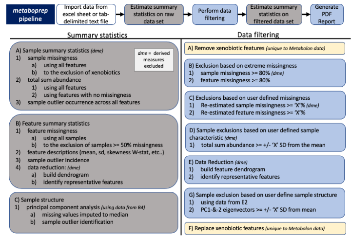

<!-- README.md is generated from README.Rmd. Please edit that file -->

```{r, include = FALSE}
knitr::opts_chunk$set(
  collapse = TRUE,
  comment = "#>",
  fig.path = "man/figures/README-",
  out.width = "100%"
)
```

# metaboprep
<!-- badges: start -->
[](https://lifecycle.r-lib.org/articles/stages.html#experimental)
<!-- badges: end -->

<!-- <div style="text-align: center"> -->
<!--     -->
<!-- </div> -->


The goal of `metaboprep` is to:  

1. Read in and processes (un)targeted metabolite data, saving datasets in tab-delimited format for use elsewhere
2. Provide useful summary data in the form of tab-delimited text file and a html report.  
3. Perform data filtering on the data set using a standard pipeline and according to user-defined thresholds.  


## Installation

You can install the development version of metaboprep from [GitHub](https://github.com/MRCIEU/metaboprep/tree/v2_development) with:

``` r
# install.packages("pak")
pak::pak("MRCIEU/metaboprep")
```

## Quality control pipeline



## Example

This is a basic example which shows you how to load data and run the `metaboprep` quality control pipeline.

```{r example}
library(metaboprep)

# the data
data_file <- system.file("extdata", "metabolon_v1_example.xlsx", package = "metaboprep")

# import data 
dat <- read_metabolon_v1(system.file("extdata", "metabolon_v1_example.xlsx", package = "metaboprep"))

# create the object
m <- Metaboprep(data = dat$data[,,1], samples = dat$samples, features = dat$features)

# run QC
m <- m |>
  quality_control(source_layer = "input", 
                  sample_missingness  = 0.5, 
                  feature_missingness = 0.3, 
                  total_peak_area_sd  = 5, 
                  outlier_udist       = 5, 
                  outlier_treatment   = "leave_be", 
                  winsorize_quantile  = 1.0, 
                  tree_cut_height     = 0.5, 
                  pc_outlier_sd       = 5, 
                  sample_ids          = NULL, 
                  feature_ids         = NULL)

# view 
m

# view tree
tree <- attr(m@feature_summary, "qc_tree")
dend <- stats::as.dendrogram(tree)
plot(dend)

```


