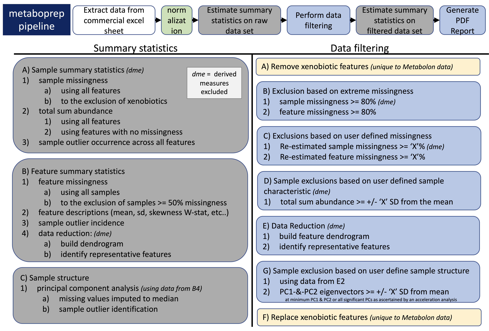
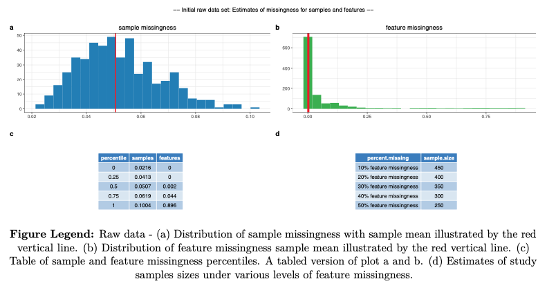
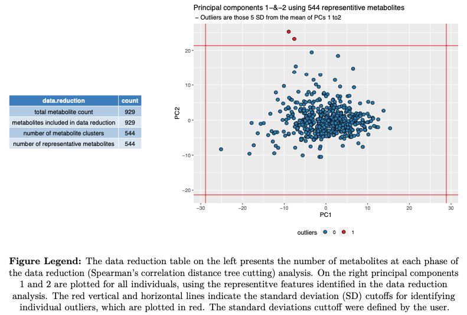
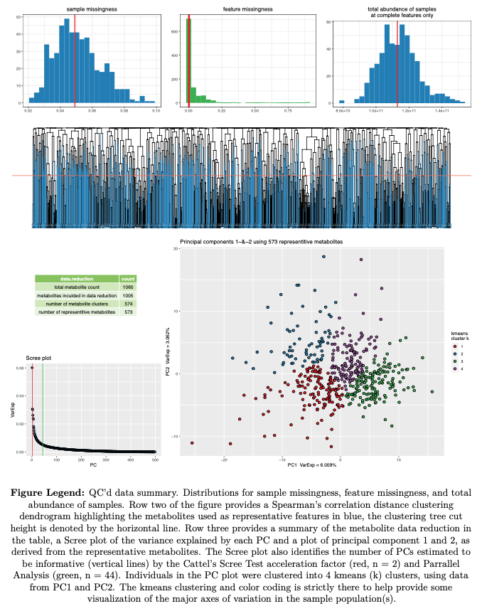
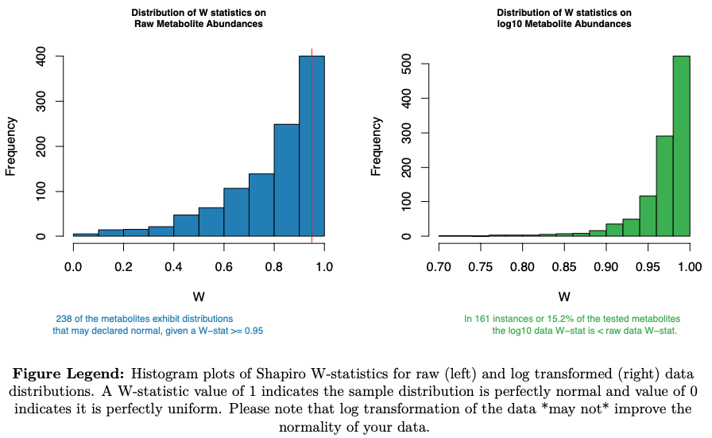
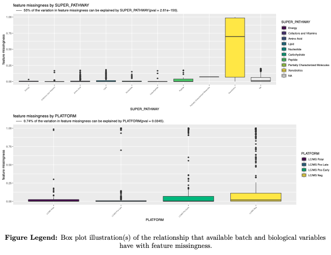
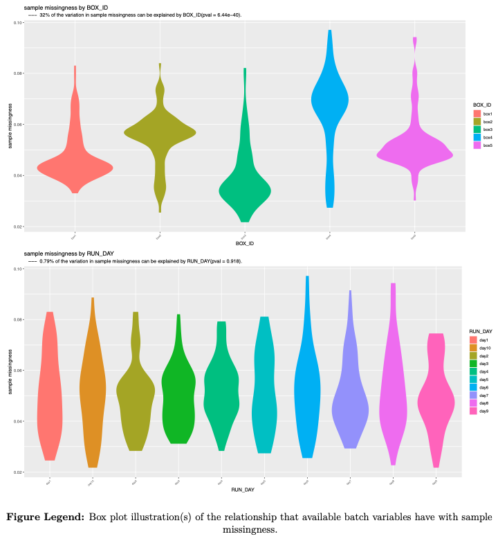
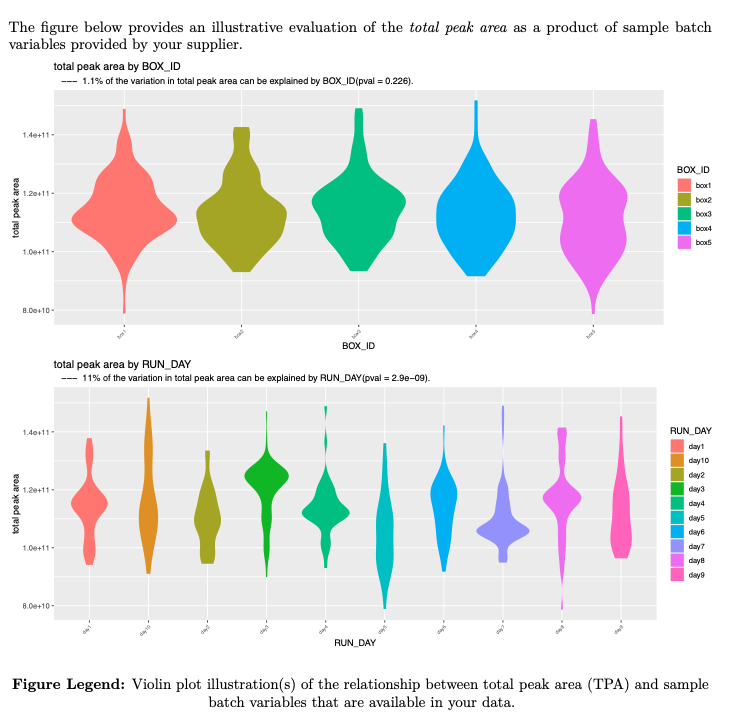

# Metabolite data preparation pipeline - version 1.0

by: David Hughes and Laura Corbin	
date: June 3rd 2019 

 

## This package
1. Reads in and processes (un)targeted metabolite data, saving datasets in tab-delimited format for use elsewhere
2. Provides useful summary data in the form of tab-delimited text file and a PDF report.
3. Performs data filtering on the data set using a standard pipeline and according to user-defined thresholds.

## Install metaboprep
1. To install do the following
	
	 1. quick install
		1. start an R session
		2. install the metaboprep package with
			
			```R
			devtools::install_github("MRCIEU/metaboprep")
			```
			
		3. from this repo download a copy of the following files
			1. run_metaboprep_pipeline.R
			2. parameter_file.txt
			3. metaboprep_Report.Rmd
			
			* You can also download or clone the entire repo with
				
				```R
				git clone https://github.com/MRCIEU/metaboprep.git
				```
				
	2. alternatively you can download the package manually
		1. download a copy of the depository
		2. unzip/pack the download
		3. place the directory somewhere sensible
		4. start an R session
		5. set your working directory to the parent directory of the repo
		6. install R package with: 
			
			```R
			devtools::install("metaboprep")
			```
			
	3. A common installation error is produced by installation errors of dependent packages. If you experience this, install those dependent packages manually with BiocManager, and then attempt the installation of metaboprep again. You might have to repeat this step more than once. 

		```R
		if (!requireNamespace("BiocManager", quietly = TRUE))
	   install.packages("BiocManager")
		BiocManager::install()
		```


## To run metaboprep

1. Edit the paramater (parameter_file.txt) file
	1.	do not add any spaces before or after the "=" sign in the paramater file.
	2. the paramater file can be located anywhere
2. Move to the, or a, directory containing both:
	1. run_metaboprep_pipeline.R
	2. metaboprep_Report.Rmd
3. Make sure that R is in your environment - an often necessary step if working on an HPC.
	1. for example: module add languages/R-3.5-ATLAS-gcc-7.1.0
4. Run the metaboprep pipeline on a terminal command line as follows:
	
	```R	
	Rscript run_metaboprep_pipeline.R /FULL/PATH/TO/example_data/excel/parameter_file.txt
	```
	
5. We have seen that the generation of the PDF report "Project_Data_Report.pdf" fail on HPC clusters. If you experience this you can generate your PDF report on a local machine as follows.
	1. move to your newly generated metaboprep project directory. 
		* it will take the form of "../metaboprep_release_TODAYSDATE/"
	2. You should find an R data object called "ReportData.Rdata". Save a copy locally.
	3. Open an R session
	4. produce report with the function generate_report() as
		
		```R
		output_dir_path = paste0("FULL/PATH/", "metaboprep_release_TODAYSDATE/")
		rdfile = paste0(output_dir_path, "ReportData.Rdata")
		generate_report( full_path_2_Rdatafile = rdfile, dir_4_report = output_dir_path )

		```

## Data Preparation steps in brief



### -- a detailed synopsis can be found on this git repository's wiki --

### (A) General Outline of metaboprep
1. Read in the paramater file
2. Read in the data  -  *(typically from a commercially provided excel file)*
	* metabolite abundance
	* sample annotation
	* feature annotation
3. Write metabolite data, sample annotation and feature annotation to flat text file.
4. If data is from Metabolon or is any other technology that has run-mode or platform batches, median normalize the data. 
5. Estimate summary statistics on the raw data set **(step B below)**
	* write summary stats to file
6. Perfom the data filtering **(step C below)**
	* using parameters passed in the parameter file 
	* write data filtering (metaboprep) data set to file
7. Estimate sumary statistics on the filtered data set **(step B below)**
	* write summary stats to file
8. Generate PDF report

### (B) Summary Statistic Estimation
1. Sample Summary Statistics
	* sample missingness
		+ all features
		+ to the exclusion of xenobiotic and\or derived variables
	* sample total peak area (TPA) **(derived variables excluded)**
		+ with all features 
		+ with complete features only (no missingness) 
	* count of how many times a sample is an outlier across all feature
		+ each feature analyzed within its own sample distribution
		+ outliers determined as those +/- 5 SD of the mean.
2. Feature Summary Statistics
	* feature missingness
		+ all samples
		+ to the exclusion of sample(s) with extreme missingness (>= 50%)
	* distribution statistics
		+ shaprio's W-statistic of normality on raw distribution
		+ shaprio's W-statistic of normality on log10 distribution
		+ skewness
		+ kutosis
		+ N, sample size
		+ variance
		+ standard deviation
		+ coefficient of variation
		+ mean
		+ median
		+ min
		+ max
	* feature outlying sample count
		+ count of outlying samples 
			+ outliers determined as those +/- 5 SD of the mean.
3. Feature and Sample structure
	* feature:feature correlation structure **(derived variables excluded)**
		+ only includes features with at least 50 measurments
			+ or if the data set has an N<50 the missingness allowed is 0.8 * N
		+ estimate the number of independent features
		+ tag representitive features of feature clusters
	* sample:sample correaltion structure **(derived variables excluded)**
		+ principle components (PCA)
			* derived from independent features
			* missing data is imputed to the median estiamte of each feature
			* identify PC outliers
				* +/- 3,4,5 SD of mean for all significant PCs

### (C) Data Filtering Steps
1. If data is from Metabolon, exclude (but retain for step 11) xenobiotic metabolites from anlaysis.
2. Estimate sample missingness and exclude extreme samples, those with a missingness >= 0.80 (or 80%) **(derived variables excluded)**
3. Estimate feature missingness and exclude extreme features, those with a missingness >= 0.80 (or 80%)
4. Re-estimate sample missingness and exclude samples >= user defined threshold (units: 0.2 or 20% missing) **(derived variables excluded)**
5. Re-estimate feature missingness and exclude features >= user defined threshold (units: 0.2 or 20% missing)
6. Estimate total peak area (the sum of all values) for each individual using complete features only and exclude samples >= user defined threshold (units: +/- SD from mean)  **(derived variables excluded)**
	* To ignore this step set to NA in parameter file
8. Build feature:feature correlation matrix on filtered data derived from steps 1-6 above **(derived variables excluded)**
	* To be included a feature must have a minimun of 50 observations, or N*0.8 observations if data set includes less than 50 individuals.
9. Identify "independent" features using data from step 8 and user defined tree cut height.
	* we retain the feature with the least missingness within a cluster, otherwise we select the first feature in the list. 	
10. Estimate principal components using indpendent features from step 9, and exclude on samples >= user defined threshold (units: +/- SD from the mean)
11. If the data is from Metabolon we place the xenobiotic metabolites back into the filtered data set. 


**NOTE: Derived variable are those that are ratios or percentanges of two or more features already present in a data set, such as those found in Nightingale data.**

## PDF Report includes

*---example figures provided for illustration---*

1. General information on study
2. Raw data summary
	* sample size
	* missingness


	* table of data filtered exclusions
	* figure of PCA oulier exclusions

3. Summary of data filtered data
	* sample size
	* summary figures
		+ missingness distributions
		+ feature dendrogram
		+ PCA

	* distribtion of Shapiro W-statistics

	* outlier summary
4. Batch effects
	* feature missingness
		+ as influenced by:
			+ feature SUPER_PATHWAY (categorical function)
			+ MS method
				+ LC/MS Polar, Pos Late, Pos Early, Neg

	* sample missingness
		+ as influenced by:
			+ BOX_ID, storage box
			+ RUN_DAY, day the samples were processed on tech

		+ multivariate analysis of both BOX_ID and RUN_DAY on missingness
	* sample total peak|abundance area
		+ as influenced by:
			+ BOX_ID, storage box
			+ RUN_DAY, day the samples were processed on tech

		+ multivariate analysis of both BOX_ID and RUN_DAY on missingness
5. Power Analysis
	* presence -vs- absence
	* continuous
