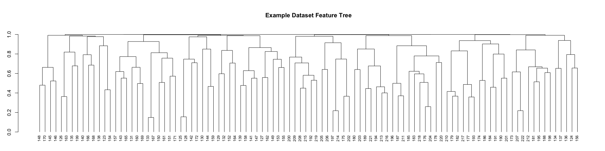

<!-- README.md is generated from README.Rmd. Please edit that file -->

# metaboprep

<!-- badges: start -->

[](https://lifecycle.r-lib.org/articles/stages.html#experimental)
<!-- badges: end -->

<!-- <div style="text-align: center"> -->
<!--     -->
<!-- </div> -->

The goal of `metaboprep` is to:

1.  Read in and processes (un)targeted metabolite data, saving datasets
    in tab-delimited format for use elsewhere
2.  Provide useful summary data in the form of tab-delimited text file
    and a html report.  
3.  Perform data filtering on the data set using a standard pipeline and
    according to user-defined thresholds.

## Installation

You can install the development version of metaboprep from
[GitHub](https://github.com/MRCIEU/metaboprep/tree/v2_development) with:

``` r
# install.packages("pak")
pak::pak("MRCIEU/metaboprep")
```

## Cheatsheet

<figure>

<figcaption aria-hidden="true">Cheatsheet</figcaption>
</figure>

## Example

This is a basic example which shows you how to load data and run the
`metaboprep` quality control pipeline.

### Read data into R and create the Metaboprep object

``` r
library(metaboprep)

# import data 
m <- read_metabolon(system.file("extdata", "metabolon_v1.1_example.xlsx", package = "metaboprep"), 
                    sheet = "OrigScale",      ## The name of the sheet in the excel file to read in
                    return_Metaboprep = TRUE  ## Whether to return a Metaboprep object (TRUE) or a list (FALSE)
                    )
```

### Run the quality control pipeline

``` r
# run QC
m <- suppressWarnings( quality_control(m, source_layer = "input", 
                  sample_missingness  = 0.2, 
                  feature_missingness = 0.2, 
                  total_peak_area_sd  = 5, 
                  outlier_udist       = 5, 
                  outlier_treatment   = "leave_be", 
                  winsorize_quantile  = 1.0, 
                  tree_cut_height     = 0.5, 
                  pc_outlier_sd       = 5, 
                  sample_ids          = NULL, 
                  feature_ids         = NULL) )
#> 
#> ── Starting Metabolite QC Process ──────────────────────────────────────────────
#> ℹ Validating input parameters
#> ✔ Validating input parameters [5ms]
#> 
#> ℹ Sample & Feature Summary Statistics for raw data
#> ✔ Sample & Feature Summary Statistics for raw data [475ms]
#> 
#> ℹ Copying input data to new 'qc' data layer
#> ✔ Copying input data to new 'qc' data layer [11ms]
#> 
#> ℹ Assessing for extreme sample missingness >=80% - excluding 0 sample(s)
#> ✔ Assessing for extreme sample missingness >=80% - excluding 0 sample(s) [7ms]
#> 
#> ℹ Assessing for extreme feature missingness >=80% - excluding 0 feature(s)
#> ✔ Assessing for extreme feature missingness >=80% - excluding 0 feature(s) [7ms]
#> 
#> ℹ Assessing for sample missingness at specified level of >=20% - excluding 0 sa…
#> ✔ Assessing for sample missingness at specified level of >=20% - excluding 2 sa…
#> 
#> ℹ Assessing for feature missingness at specified level of >=20% - excluding 0 f…
#> ✔ Assessing for feature missingness at specified level of >=20% - excluding 0 f…
#> 
#> ℹ Calculating total peak abundance outliers at +/- 5 Sdev - excluding 0 sample(…
#> ✔ Calculating total peak abundance outliers at +/- 5 Sdev - excluding 0 sample(…
#> 
#> ℹ Running sample data PCA outlier analysis at +/- 5 Sdev
#> ✔ Running sample data PCA outlier analysis at +/- 5 Sdev [8ms]
#> 
#> ℹ Sample PCA outlier analysis - re-identify feature independence and PC outlier…
#> ✔ Sample PCA outlier analysis - re-identify feature independence and PC outlier…
#> 
#> ℹ Creating final QC dataset...
#> ✔ Creating final QC dataset... [471ms]
#> 
#> ℹ Metabolite QC Process Completed
#> ✔ Metabolite QC Process Completed [9ms]
#> 
```

### View a summary of the Metaboprep object

``` r
# view summary
summary(m)
#> Metaboprep Object Summary
#> --------------------------
#> Samples      : 100
#> Features     : 100
#> Data Layers  : 2
#> Layer Names  : input, qc
#> 
#> Sample Summary Layers : input, qc
#> Feature Summary Layers: input, qc
#> 
#> Sample Annotation (metadata):
#>   Columns: 8
#>   Names  : sample_id, neg, pos, run_day, box_id, lot, reason_excluded, excluded
#> 
#> Feature Annotation (metadata):
#>   Columns: 8
#>   Names  : feature_id, metabolite_id, platform, pathway, kegg, group_hmdb, reason_excluded, excluded
#> 
#> Exclusion Codes Summary:
#> 
#>   Sample Exclusions:
#> Exclusion | Count
#> -----------------
#> user_excluded                     | 0
#> extreme_sample_missingness        | 0
#> user_defined_sample_missingness   | 2
#> user_defined_sample_totalpeakarea | 0
#> user_defined_sample_pca_outlier   | 0
#> 
#>   Feature Exclusions:
#> Exclusion | Count
#> -----------------
#> user_excluded                    | 0
#> extreme_feature_missingness      | 0
#> user_defined_feature_missingness | 0
```

### Plot a dendrogram of the feature tree

``` r
# view feature tree
tree <- attr(m@feature_summary, "qc_tree")
par(mar = c(1,3,5,1) )
plot(tree, hang = -1, cex = 0.75, main = "Example Dataset Feature Tree", sub = "", xlab = "")
```


