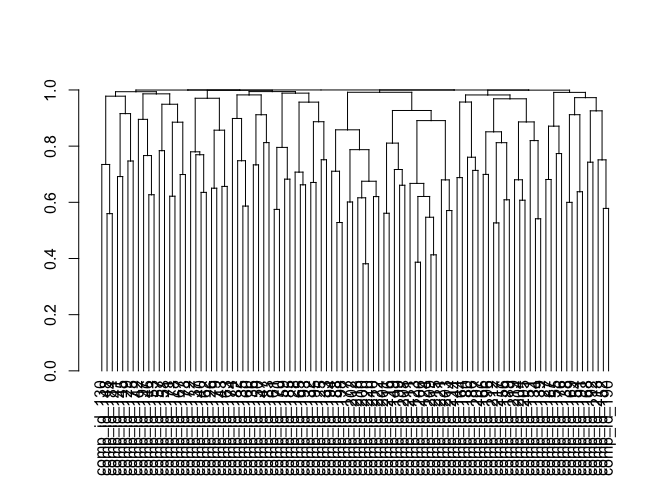

<!-- README.md is generated from README.Rmd. Please edit that file -->

# metaboprep

<!-- badges: start -->

[](https://lifecycle.r-lib.org/articles/stages.html#experimental)
<!-- badges: end -->

<!-- <div style="text-align: center"> -->

<!--     -->

<!-- </div> -->

The goal of `metaboprep` is to:

1.  Read in and processes (un)targeted metabolite data, saving datasets
    in tab-delimited format for use elsewhere
2.  Provide useful summary data in the form of tab-delimited text file
    and a html report.  
3.  Perform data filtering on the data set using a standard pipeline and
    according to user-defined thresholds.

## Installation

You can install the development version of metaboprep from
[GitHub](https://github.com/MRCIEU/metaboprep/tree/v2_development) with:

``` r
# install.packages("pak")
pak::pak("MRCIEU/metaboprep")
```

## Cheatsheet


## Example

This is a basic example which shows you how to load data and run the
`metaboprep` quality control pipeline.

``` r
library(metaboprep)

# import data 
dat <- read_metabolon(system.file("extdata", "metabolon_v1.1_example.xlsx", package = "metaboprep"), sheet="OrigScale")

# create the object
m <- Metaboprep(data = dat$data, samples = dat$samples, features = dat$features)

# run QC
m <- m |>
  quality_control(source_layer = "input", 
                  sample_missingness  = 0.5, 
                  feature_missingness = 0.3, 
                  total_peak_area_sd  = 5, 
                  outlier_udist       = 5, 
                  outlier_treatment   = "leave_be", 
                  winsorize_quantile  = 1.0, 
                  tree_cut_height     = 0.5, 
                  pc_outlier_sd       = 5, 
                  sample_ids          = NULL, 
                  feature_ids         = NULL)
#> 
#> ── Starting Metabolite QC Process ──────────────────────────────────────────────
#> ℹ Validating input parameters✔ Validating input parameters [4ms]
#> ℹ Sample & Feature Summary Statistics for raw data✔ Sample & Feature Summary Statistics for raw data [449ms]
#> ℹ Copying input data to new 'qc' data layer✔ Copying input data to new 'qc' data layer [12ms]
#> ℹ Assessing for extreme sample missingness >=80% - excluding 0 sample(s)✔ Assessing for extreme sample missingness >=80% - excluding 0 sample(s) [8ms]
#> ℹ Assessing for extreme feature missingness >=80% - excluding 0 feature(s)✔ Assessing for extreme feature missingness >=80% - excluding 0 feature(s) [8ms]
#> ℹ Assessing for sample missingness at specified level of >=50% - excluding 0 sa…✔ Assessing for sample missingness at specified level of >=50% - excluding 0 sa…
#> ℹ Assessing for feature missingness at specified level of >=30% - excluding 0 f…✔ Assessing for feature missingness at specified level of >=30% - excluding 0 f…
#> ℹ Calculating total peak abundance outliers at +/- 5 Sdev - excluding 0 sample(…✔ Calculating total peak abundance outliers at +/- 5 Sdev - excluding 0 sample(…
#> ℹ Running sample data PCA outlier analysis at +/- 5 Sdev✔ Running sample data PCA outlier analysis at +/- 5 Sdev [8ms]
#> ℹ Sample PCA outlier analysis - re-identify feature independence and PC outlier…ℹ Sample PCA outlier analysis - re-identify feature independence and PC outlier…✔ Sample PCA outlier analysis - re-identify feature independence and PC outlier…
#> ℹ Creating final QC dataset...✔ Creating final QC dataset... [445ms]
#> ℹ Metabolite QC Process Completed✔ Metabolite QC Process Completed [10ms]

# view 
m
#> <metaboprep::Metaboprep>
#>  @ data           : num [1:100, 1:100, 1:2] 11.03 12.5 NA 6.98 8.56 ...
#>  .. - attr(*, "dimnames")=List of 3
#>  ..  ..$ : chr [1:100] "ind1" "ind2" "ind3" "ind4" ...
#>  ..  ..$ : chr [1:100] "123" "124" "125" "126" ...
#>  ..  ..$ : chr [1:2] "input" "qc"
#>  .. - attr(*, "qc_sample_missingness")= num 0.5
#>  .. - attr(*, "qc_feature_missingness")= num 0.3
#>  .. - attr(*, "qc_total_peak_area_sd")= num 5
#>  .. - attr(*, "qc_outlier_udist")= num 5
#>  .. - attr(*, "qc_outlier_treatment")= chr "leave_be"
#>  .. - attr(*, "qc_winsorize_quantile")= num 1
#>  .. - attr(*, "qc_tree_cut_height")= num 0.5
#>  .. - attr(*, "qc_pc_outlier_sd")= num 5
#>  .. - attr(*, "qc_features_exclude_but_keep")= chr(0) 
#>  @ samples        :'data.frame': 100 obs. of  8 variables:
#>  .. $ sample_id      : chr  "ind1" "ind2" "ind3" "ind4" ...
#>  .. $ neg            : chr  "batch1" "batch1" "batch1" "batch1" ...
#>  .. $ pos            : chr  "batch1" "batch1" "batch1" "batch1" ...
#>  .. $ run_day        : chr  "day1" "day1" "day1" "day1" ...
#>  .. $ box_id         : chr  "box1" "box1" "box1" "box1" ...
#>  .. $ lot            : chr  "lot250" "lot250" "lot250" "lot250" ...
#>  .. $ reason_excluded: chr  NA NA NA NA ...
#>  .. $ excluded       : logi  FALSE FALSE FALSE FALSE FALSE FALSE ...
#>  @ features       :'data.frame': 100 obs. of  8 variables:
#>  .. $ feature_id     : chr  "123" "124" "125" "126" ...
#>  .. $ metabolite_id  : chr  "met1" "met2" "met3" "met4" ...
#>  .. $ platform       : chr  "neg" "neg" "neg" "neg" ...
#>  .. $ pathway        : chr  "xenobiotic" "xenobiotic" "xenobiotic" "lipid" ...
#>  .. $ kegg           : chr  "K100" "K100" "K100" "K200" ...
#>  .. $ group_hmdb     : chr  "HMDB1" "HMDB2" "HMDB3" "HMDB4" ...
#>  .. $ reason_excluded: chr  NA NA NA NA ...
#>  .. $ excluded       : logi  FALSE FALSE FALSE FALSE FALSE FALSE ...
#>  @ exclusions     :List of 2
#>  .. $ samples :List of 5
#>  ..  ..$ user_excluded                    : chr(0) 
#>  ..  ..$ extreme_sample_missingness       : chr(0) 
#>  ..  ..$ user_defined_sample_missingness  : chr(0) 
#>  ..  ..$ user_defined_sample_totalpeakarea: chr(0) 
#>  ..  ..$ user_defined_sample_pca_outlier  : chr(0) 
#>  .. $ features:List of 3
#>  ..  ..$ user_excluded                   : chr(0) 
#>  ..  ..$ extreme_feature_missingness     : chr(0) 
#>  ..  ..$ user_defined_feature_missingness: chr(0) 
#>  @ feature_summary: num [1:20, 1:100, 1:2] 0.2 0 80 10.51 2.25 ...
#>  .. - attr(*, "dimnames")=List of 3
#>  ..  ..$ : chr [1:20] "missingness" "outlier_count" "n" "mean" ...
#>  ..  ..$ : chr [1:100] "123" "124" "125" "126" ...
#>  ..  ..$ : chr [1:2] "input" "qc"
#>  .. - attr(*, "qc_tree")=List of 7
#>  ..  ..$ merge      : int [1:99, 1:2] -11 -3 -75 -85 -54 -57 -55 -4 -65 -53 ...
#>  ..  ..$ height     : num [1:99] 0.149 0.155 0.21 0.218 0.26 ...
#>  ..  ..$ order      : int [1:100] 58 81 67 99 72 91 94 74 65 89 ...
#>  ..  ..$ labels     : chr [1:100] "123" "124" "125" "126" ...
#>  ..  ..$ method     : chr "complete"
#>  ..  ..$ call       : language stats::hclust(d = dist_matrix, method = "complete")
#>  ..  ..$ dist.method: NULL
#>  ..  ..- attr(*, "class")= chr "hclust"
#>  .. - attr(*, "qc_outlier_udist")= num 5
#>  .. - attr(*, "qc_tree_cut_height")= num 0.5
#>  @ sample_summary : num [1:100, 1:20, 1:2] 0 0 0.02 0 0 0 0 0 0.29 0 ...
#>  .. - attr(*, "dimnames")=List of 3
#>  ..  ..$ : chr [1:100] "ind1" "ind2" "ind3" "ind4" ...
#>  ..  ..$ : chr [1:20] "missingness" "tpa_total" "tpa_complete_features" "outlier_count" ...
#>  ..  ..$ : chr [1:2] "input" "qc"
#>  .. - attr(*, "qc_varexp")= Named num [1:77] 0.1316 0.093 0.0449 0.0397 0.0353 ...
#>  ..  ..- attr(*, "names")= chr [1:77] "PC1" "PC2" "PC3" "PC4" ...
#>  .. - attr(*, "qc_num_pcs_scree")= num 2
#>  .. - attr(*, "qc_num_pcs_parallel")= int 7
#>  .. - attr(*, "qc_outlier_udist")= num 5

# view tree
tree <- attr(m@feature_summary, "qc_tree")
dend <- stats::as.dendrogram(tree)
plot(dend)
```


