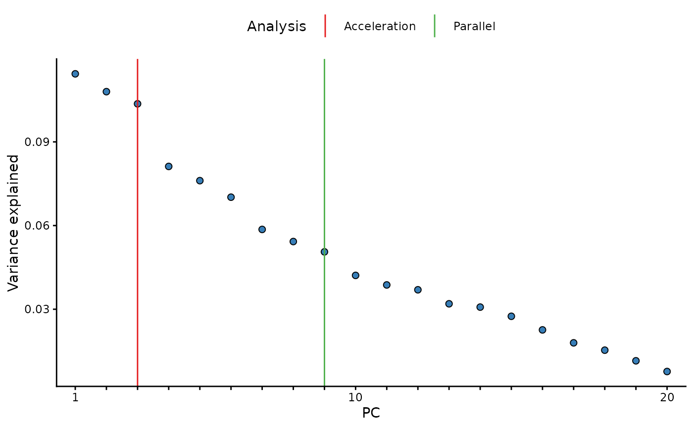

# Sample summary

## Create Metaboprep object

``` r
library(metaboprep)

# import data
data     <- read.csv(system.file("extdata", "dummy_data.csv",     package = "metaboprep"), header=T, row.names = 1) |> as.matrix()
samples  <- read.csv(system.file("extdata", "dummy_samples.csv",  package = "metaboprep"), header=T, row.names = 1)
features <- read.csv(system.file("extdata", "dummy_features.csv", package = "metaboprep"), header=T, row.names = 1)

# create object
mydata <- Metaboprep(data = data, samples = samples, features = features)
```

## Summary of Metaboprep object

``` r
summary(mydata)
#> Metaboprep Object Summary
#> --------------------------
#> Samples      : 100
#> Features     : 20
#> Data Layers  : 1
#> Layer Names  : input
#> 
#> Sample Summary Layers : none
#> Feature Summary Layers: none
#> 
#> Sample Annotation (metadata):
#>   Columns: 5
#>   Names  : sample_id, age, sex, pos, neg
#> 
#> Feature Annotation (metadata):
#>   Columns: 5
#>   Names  : feature_id, platform, pathway, derived_feature, xenobiotic_feature
#> 
#> Exclusion Codes Summary:
#> 
#>   Sample Exclusions:
#> Exclusion | Count
#> -----------------
#> user_excluded                     | 0
#> extreme_sample_missingness        | 0
#> user_defined_sample_missingness   | 0
#> user_defined_sample_totalpeakarea | 0
#> user_defined_sample_pca_outlier   | 0
#> 
#>   Feature Exclusions:
#> Exclusion | Count
#> -----------------
#> user_excluded                    | 0
#> extreme_feature_missingness      | 0
#> user_defined_feature_missingness | 0
```

## Run sample summary

``` r
# note that for illustrative purposes we are using a log outlier unit distance of 1.0 here, in practice we tend to favor a value of 5.0.
sample_sum1 <- sample_summary(metaboprep      = mydata, 
                              source_layer    = "input", 
                              outlier_udist   = 1.0,
                              output          = "data.frame")
```

## Table of sample summary

| sample_id | missingness | tpa_total | tpa_complete_features | outlier_count |
|:---------:|:-----------:|:---------:|:---------------------:|:-------------:|
|  id_100   |      0      |  38.699   |        38.699         |       0       |
|   id_99   |      0      |  39.451   |        39.451         |       0       |
|   id_98   |      0      |  45.135   |        45.135         |       1       |
|   id_97   |      0      |  37.289   |        37.289         |       2       |
|   id_96   |      0      |  31.545   |        31.545         |       3       |
|   id_95   |      0      |  36.751   |        36.751         |       2       |
|   id_94   |      0      |  37.384   |        37.384         |       0       |
|   id_93   |      0      |  34.069   |        34.069         |       0       |
|   id_92   |      0      |  38.942   |        38.942         |       0       |
|   id_91   |      0      |  42.743   |        42.743         |       2       |

## Run sample summary on subset

Using the `sample_ids` and `feature_ids` arguments you can run the
summary for a subset of the data. Note: all rows will be return, however
summary data will only be returned for the specified ids.

``` r
## define a vector of sample IDs
sids <- mydata@samples[mydata@samples$sex == "female", "sample_id"] 

## define a vector of feature IDs
fids <- mydata@features[, "feature_id"] |> sample(10)

# run sample summary on subset
sample_sum_subset <- sample_summary(metaboprep    = mydata, 
                                    source_layer  = "input", 
                                    outlier_udist = 1.0,
                                    sample_ids    = sids,
                                    feature_ids   = fids,
                                    output        = "data.frame")
```

## Table of sample summary on subset

| sample_id | missingness | tpa_total | tpa_complete_features | outlier_count |
|:---------:|:-----------:|:---------:|:---------------------:|:-------------:|
|   id_98   |      0      |  22.241   |        22.241         |       0       |
|   id_97   |      0      |  15.765   |        15.765         |       1       |
|   id_96   |      0      |  17.082   |        17.082         |       1       |
|   id_94   |      0      |  17.010   |        17.010         |       0       |
|   id_93   |      0      |  17.478   |        17.478         |       1       |
|   id_92   |      0      |  22.147   |        22.147         |       0       |
|   id_90   |      0      |  14.568   |        14.568         |       1       |
|   id_89   |      0      |  22.601   |        22.601         |       1       |
|   id_88   |      0      |  18.243   |        18.243         |       2       |
|   id_87   |      0      |  17.149   |        17.149         |       0       |

## Run PCA analysis

[`pc_and_outliers()`](https://mrcieu.github.io/metaboprep/reference/pc_and_outliers.md)
performs principal component analysis. Missing data is imputed to the
median and used to identify the number of informative or ‘significant’
PCs by (1) an acceleration analysis, and (2) a parallel analysis.
Finally the number of sample outliers are determined at 3, 4, and 5
standard deviations from the mean on the top PCs as determined by the
acceleration factor analysis.

``` r
pc_analysis <- pc_and_outliers(metaboprep   = mydata, 
                               source_layer = "input",
                               sample_ids   = sids, ## It is also possible to run on a subset of samples and/or features
                               feature_ids  = NULL
                               )
```

## Table of PCA analysis results

Returned are the PC eigenvectors for the top 10 PCs, and outlier counts
at 3, 4, and 5 standard deviations from the mean for the top two PCs

| sample_id |  pc1   |  pc2   |  pc3   |  pc4   |  pc5   |  pc6   |  pc7   |  pc8   |  pc9   |  pc10  | pc1_3_sd_outlier | pc2_3_sd_outlier | pc3_3_sd_outlier | pc1_4_sd_outlier | pc2_4_sd_outlier | pc3_4_sd_outlier | pc1_5_sd_outlier | pc2_5_sd_outlier | pc3_5_sd_outlier |
|:---------:|:------:|:------:|:------:|:------:|:------:|:------:|:------:|:------:|:------:|:------:|:----------------:|:----------------:|:----------------:|:----------------:|:----------------:|:----------------:|:----------------:|:----------------:|:----------------:|
|   id_98   | 1.504  | -0.899 | -0.072 | -0.987 | 1.221  | 0.429  | -1.603 | 0.586  | -1.086 | -0.193 |        0         |        0         |        0         |        0         |        0         |        0         |        0         |        0         |        0         |
|   id_97   | 0.826  | 0.458  | 1.623  | 0.188  | -1.195 | 1.666  | -1.318 | -2.481 | -1.081 | 1.007  |        0         |        0         |        0         |        0         |        0         |        0         |        0         |        0         |        0         |
|   id_96   | -2.067 | 0.785  | -1.024 | 1.720  | 1.435  | 0.663  | 1.057  | -0.073 | -1.554 | -0.479 |        0         |        0         |        0         |        0         |        0         |        0         |        0         |        0         |        0         |
|   id_94   | -1.635 | 1.103  | 0.791  | 1.214  | -0.920 | -0.986 | 1.635  | 0.401  | -0.521 | 1.214  |        0         |        0         |        0         |        0         |        0         |        0         |        0         |        0         |        0         |
|   id_93   | -1.399 | 1.202  | -0.168 | -2.277 | 1.068  | -1.482 | -0.129 | -1.497 | 0.834  | 1.243  |        0         |        0         |        0         |        0         |        0         |        0         |        0         |        0         |        0         |
|   id_92   | 2.299  | 0.640  | 1.312  | 0.308  | -0.094 | 0.492  | 0.595  | -0.751 | 0.994  | -1.484 |        0         |        0         |        0         |        0         |        0         |        0         |        0         |        0         |        0         |
|   id_90   | -0.723 | 1.214  | 1.251  | 1.834  | -1.257 | 0.548  | -1.184 | -1.282 | 0.829  | 0.076  |        0         |        0         |        0         |        0         |        0         |        0         |        0         |        0         |        0         |
|   id_89   | -0.292 | 0.097  | 2.914  | 1.079  | -0.734 | -1.654 | 0.601  | 0.015  | -0.721 | 0.914  |        0         |        0         |        0         |        0         |        0         |        0         |        0         |        0         |        0         |
|   id_88   | 2.664  | 1.542  | -2.028 | 0.080  | 0.419  | -0.416 | 1.305  | -1.710 | 0.352  | -0.213 |        0         |        0         |        0         |        0         |        0         |        0         |        0         |        0         |        0         |
|   id_87   | -2.053 | 0.898  | -0.883 | 0.960  | 0.578  | 1.764  | -0.703 | 0.158  | 0.812  | 0.708  |        0         |        0         |        0         |        0         |        0         |        0         |        0         |        0         |        0         |

## Additional attributes

In addition, the variance explained vector is appended to the returned
`data.frame` as and `attribute`. This can be accessed with the attribute
name: `[source_layer]_varexp`, in this case we used the `input` data,
therefore the attribute name is `input_varexp`. In a similar way, the
results of the acceleration analysis (`input_num_pcs_scree`) and a
parallel analysis (`input_num_pcs_parallel`) can also be extracted.

``` r
library(ggplot2)

# extract varexp from attributes
varexp <- attr(pc_analysis, 'input_varexp')

# subset to top 100 for nicer plotting
if (length(varexp) > 100) varexp <- varexp[1:100]

# get acceleration and parallel analysis results
af <- attr(pc_analysis, 'input_num_pcs_scree')
np <- attr(pc_analysis, 'input_num_pcs_parallel')
if (af==np) np <- np+0.1 # make line visible if equal

# as data.frame
x_labs <- sub("(?i)pc","", names(varexp))
ve     <- data.frame("pc"      = factor(x_labs, levels=x_labs),
                     "var_exp" = varexp)
lines  <- data.frame("Analysis" = c("Acceleration", "Parallel"), 
                     "pc"       = c(af, np))   

# plot
ggplot(ve, aes(x = pc, y = var_exp)) +
  geom_line(color = "grey") +
  geom_point(shape = 21, fill = "#377EB8", size = 2) +
  geom_vline(data = lines, aes(xintercept = pc, color = Analysis), inherit.aes = FALSE) +
  scale_color_manual(values = c("Acceleration"="#E41A1C", "Parallel"="#4DAF4A")) +
  scale_x_discrete(labels = function(x) ifelse(seq_along(x) %% 10 == 0 | x==1, x, "")) +
  labs(x = "PC", y = "Variance explained") +
  theme_classic() +
  theme(legend.position = "top")
```



## Run sample & feature summaries together

``` r
sf_sum <- summarise(metaboprep    = mydata, 
                    source_layer    = "input", 
                    outlier_udist   = 1.0,
                    tree_cut_height = 0.5,
                    sample_ids      = sids, ## It is also possible to run on a subset of samples and/or features
                    feature_ids     = NULL,
                    output          = "data.frame")

## two data frames are returned as a list object
names(sf_sum)
#> [1] "sample_summary"  "feature_summary"
```

## Table of sample summary on subset

Note that when the summarise() function is used the sample summary now
includes PCA derived summary data. This is not the case when the
sample_summary() function is run alone, as seen above. The reason for
the difference is because the PCA data is dependent upon the
feature_summary() analysis.

Also, please note that when running on a subset, you are returned the
full summary for all samples and features, but only the summary data for
the specified subset will be populated, the rest will be `NA`.

| sample_id | missingness | tpa_total | tpa_complete_features | outlier_count |  pc1   |  pc2   |  pc3   |  pc4   |  pc5   |  pc6   |  pc7   |  pc8   |  pc9   |  pc10  | pc1_3_sd_outlier | pc2_3_sd_outlier | pc3_3_sd_outlier | pc1_4_sd_outlier | pc2_4_sd_outlier | pc3_4_sd_outlier | pc1_5_sd_outlier | pc2_5_sd_outlier | pc3_5_sd_outlier |
|:---------:|:-----------:|:---------:|:---------------------:|:-------------:|:------:|:------:|:------:|:------:|:------:|:------:|:------:|:------:|:------:|:------:|:----------------:|:----------------:|:----------------:|:----------------:|:----------------:|:----------------:|:----------------:|:----------------:|:----------------:|
|  id_100   |     NA      |    NA     |          NA           |      NA       |   NA   |   NA   |   NA   |   NA   |   NA   |   NA   |   NA   |   NA   |   NA   |   NA   |        NA        |        NA        |        NA        |        NA        |        NA        |        NA        |        NA        |        NA        |        NA        |
|   id_99   |     NA      |    NA     |          NA           |      NA       |   NA   |   NA   |   NA   |   NA   |   NA   |   NA   |   NA   |   NA   |   NA   |   NA   |        NA        |        NA        |        NA        |        NA        |        NA        |        NA        |        NA        |        NA        |        NA        |
|   id_98   |      0      |  45.392   |        45.392         |       1       | 1.504  | -0.899 | -0.072 | -0.987 | 1.221  | 0.429  | -1.603 | 0.586  | -1.086 | -0.193 |        0         |        0         |        0         |        0         |        0         |        0         |        0         |        0         |        0         |
|   id_97   |      0      |  37.473   |        37.473         |       3       | 0.826  | 0.458  | 1.623  | 0.188  | -1.195 | 1.666  | -1.318 | -2.481 | -1.081 | 1.007  |        0         |        0         |        0         |        0         |        0         |        0         |        0         |        0         |        0         |
|   id_96   |      0      |  32.042   |        32.042         |       3       | -2.067 | 0.785  | -1.024 | 1.720  | 1.435  | 0.663  | 1.057  | -0.073 | -1.554 | -0.479 |        0         |        0         |        0         |        0         |        0         |        0         |        0         |        0         |        0         |
|   id_95   |     NA      |    NA     |          NA           |      NA       |   NA   |   NA   |   NA   |   NA   |   NA   |   NA   |   NA   |   NA   |   NA   |   NA   |        NA        |        NA        |        NA        |        NA        |        NA        |        NA        |        NA        |        NA        |        NA        |
|   id_94   |      0      |  37.615   |        37.615         |       2       | -1.635 | 1.103  | 0.791  | 1.214  | -0.920 | -0.986 | 1.635  | 0.401  | -0.521 | 1.214  |        0         |        0         |        0         |        0         |        0         |        0         |        0         |        0         |        0         |
|   id_93   |      0      |  34.238   |        34.238         |       1       | -1.399 | 1.202  | -0.168 | -2.277 | 1.068  | -1.482 | -0.129 | -1.497 | 0.834  | 1.243  |        0         |        0         |        0         |        0         |        0         |        0         |        0         |        0         |        0         |
|   id_92   |      0      |  39.200   |        39.200         |       1       | 2.299  | 0.640  | 1.312  | 0.308  | -0.094 | 0.492  | 0.595  | -0.751 | 0.994  | -1.484 |        0         |        0         |        0         |        0         |        0         |        0         |        0         |        0         |        0         |
|   id_91   |     NA      |    NA     |          NA           |      NA       |   NA   |   NA   |   NA   |   NA   |   NA   |   NA   |   NA   |   NA   |   NA   |   NA   |        NA        |        NA        |        NA        |        NA        |        NA        |        NA        |        NA        |        NA        |        NA        |
