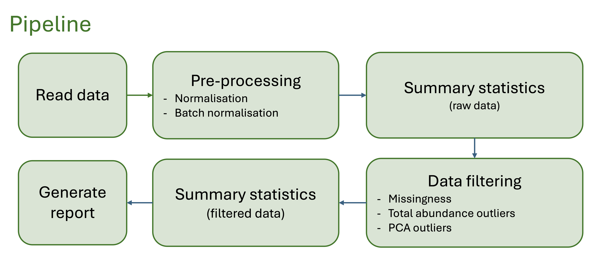

```{r setup, echo = FALSE}
knitr::opts_chunk$set(
  echo = FALSE, quote = FALSE, comment = NA,
  warning = FALSE, message = FALSE, error = FALSE,
  fig.align = "center"
)

suppressPackageStartupMessages(library(ggplot2))
suppressPackageStartupMessages(library(data.table))
suppressPackageStartupMessages(library(kableExtra))
suppressPackageStartupMessages(library(knitr))
suppressPackageStartupMessages(library(glue))

report_font <- "Helvetica"
```

\newpage

---

# Project Information

This `metaboprep` report summarizes the data preparation steps for:

- **Project:** `r project`

---

## Overview

The `metaboprep` R package performs three key operations:

1. **Assessment & Summary Statistics**: Provides an initial assessment of raw metabolomics data.
2. **Data Filtering**: Applies filtering techniques to clean the dataset.
3. **Post-Filtering Assessment**: Evaluates the filtered dataset, particularly in relation to batch variables when available.

This report contains descriptive information on both raw and filtered metabolomics data for **`r project`**.

Please raise any issues on the [GitHub issues](https://github.com/MRCIEU/metaboprep/issues) page. 

---

## Data preparation workflow:
```{r workflow, out.width="99%"}

```

---

\newpage

```{r, child="01_summary_raw_data.Rmd"}
```
